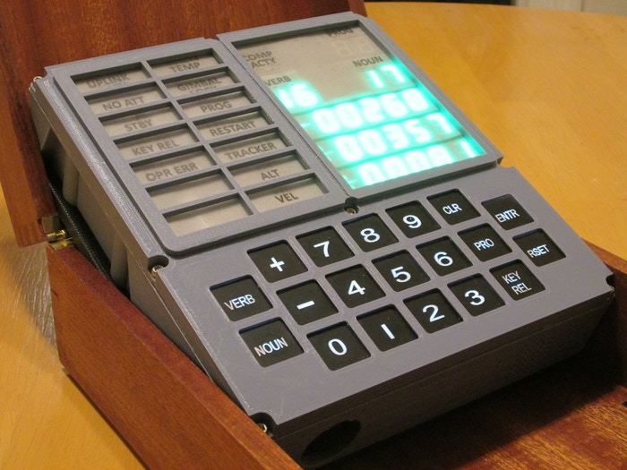

# OpenDSKY
## Open DSKY for Arduino

Open DSKY is a Kickstarter project from S&T Geotronics.  
It offers a 3D-printed replica of the Display & Keyboard (DSKY) used in the Apollo Command and Lunar Modules.  
The design is custom hardware, based on an Arduino Nano.  It does not run the original Apollo flight code.  Instead, it implements a small subset of functions, such as displaying the time, GPS coordinates, etc., and can play several selected sound bites through an internal speaker.

This project is a fork of S&T's original Arduino code, with the following goals:
- Refactoring of the original code, to make it more readable and extensible
- Possible additional future functionality
- Minimal external dependencies

The updated .ino file can be found within the 'OpenDSKY...' folder [above].

This project is NOT affiliated with S&T Geotronics.
It is offered as open-source under the MIT License.

For questions regarding the OpenDSKY project, hardware and its original software, please contact:
https://www.stgeotronics.com

### Resources

#### OpenDSKY project
https://www.instructables.com/id/Open-Apollo-Guidance-Computer-DSKY/   [how to build]  
https://www.instructables.com/id/Programming-the-Open-DSKY/  [how to program]  

#### Related GitHub projects
https://github.com/mcmadhatter/ArduOpenDSKY  
https://github.com/scottpav/OpenDSKY  

#### Original Apollo flight software
http://www.ibiblio.org/apollo/    
https://github.com/virtualagc/virtualagc    

### Running OpenDSKY code via the Arduino IDE

#### Arduino (CH340 USB chip) drivers for Mac
NOTE: The original vendor's Mac kernel extension causes kernel panics (crashes) for recent versions of Mac OS.  This appears to be a stable alternative:  
https://github.com/adrianmihalko/ch340g-ch34g-ch34x-mac-os-x-driver  

#### Processor (menu selection in Arduino IDE):
"ATmega328P (Old Bootloader)"  
  
~
  
More to come.

~
